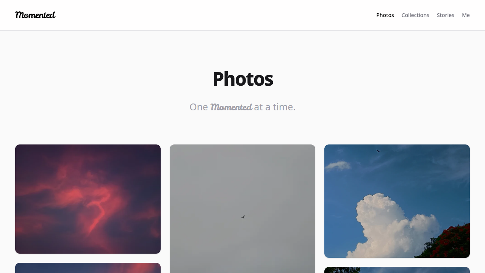
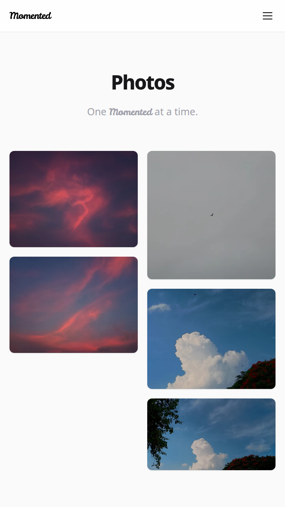

   
  <h1>📷 Momented</h1>
  

    <b>A minimalist photo journal exploring light, shadow, and the moments in between.</b>
  

  

    
    
    
    
  

 

> "Momented" is a custom-built portfolio and content management system designed to showcase photography while allowing visitors to easily download and use the captured moments.[cite: 4] Art is meant to be shared, not locked away.[cite: 4]

---

## 📑 Table of Contents

- ✨ Features
- 🛠️ Tech Stack
- 📸 Screenshots
- 🚀 Getting Started
- ⚙️ Environment Variables
- 📄 License

---

## ✨ Features

- **Masonry Photo Grid** — A beautiful, responsive gallery designed specifically for high-resolution images.[cite: 4]
- **Collections & Stories** — Group photos by thematic collections or write long-form narratives to accompany your visual stories.[cite: 4]
- **High-Res Downloads** — Built-in functionality for visitors to download original, high-resolution images directly.[cite: 4]
- **Exif Data Extraction** — Automatically reads and displays camera metadata (Focal Length, Aperture, Shutter Speed, ISO, Camera Model) when viewing a photo.[cite: 4]
- **Secure Admin Dashboard** — A protected route (`/admin`) utilizing JWT authentication to upload photos, create collections, and write stories.[cite: 4]
- **Direct Cloudinary Uploads** — Secure, signed image uploads directly from the admin dashboard to your Cloudinary storage.[cite: 4]

---

## 🛠️ Tech Stack

| Category                        | Technologies                                         |
| :------------------------------ | :--------------------------------------------------- |
| **Frontend & Framework**        | Next.js 16 (App Router), Tailwind CSS v4[cite: 1, 4] |
| **Backend, Database & Storage** | Supabase (PostgreSQL), Cloudinary[cite: 1, 4]        |
| **Security & Tooling**          | jose (JWT), bcryptjs, Biome, Bun[cite: 1, 4]         |

---

## 📸 Screenshots

  
  
<i>Desktop Gallery View</i>

   
  
  
<i>Mobile Responsive View</i>

---

## 🚀 Getting Started

Follow these steps to set up the project locally.[cite: 4]

1. Clone the repository using `git clone https://github.com/ijaik/momented.git` and navigate into the directory.[cite: 4]
2. Install dependencies by running `bun install` in your terminal.[cite: 4]
3. Start the development server by executing `bun run dev`.[cite: 4]
4. Open `http://localhost:3000` in your browser to see the live site.[cite: 4]
5. To access the CMS, navigate to `/admin/login`.[cite: 4]

---

## ⚙️ Environment Variables

Create a `.env.local` file in the root directory.[cite: 4] You will need active accounts with Supabase and Cloudinary.[cite: 4]

| Variable                               | Description                                                   |
| :------------------------------------- | :------------------------------------------------------------ |
| `NEXT_PUBLIC_SUPABASE_URL`             | Your Supabase database URL.[cite: 4]                          |
| `NEXT_PUBLIC_SUPABASE_PUBLISHABLE_KEY` | Your Supabase anonymous key.[cite: 4]                         |
| `SUPABASE_SECRET_KEY`                  | Your Supabase service role key.[cite: 4]                      |
| `NEXT_PUBLIC_CLOUDINARY_CLOUD_NAME`    | Your Cloudinary cloud name.[cite: 4]                          |
| `CLOUDINARY_API_KEY`                   | Your Cloudinary API key.[cite: 4]                             |
| `CLOUDINARY_API_SECRET`                | Your Cloudinary API secret.[cite: 4]                          |
| `ADMIN_PASSWORD_HASH`                  | Your bcrypt hashed password for the admin dashboard.[cite: 4] |
| `ADMIN_SESSION_SECRET`                 | A long, random, secure string for JWT encryption.[cite: 4]    |

> **💡 Tip:** Generate `ADMIN_PASSWORD_HASH` by hashing your desired admin password using bcrypt.[cite: 4] Generate a long, random string for `ADMIN_SESSION_SECRET`.[cite: 4]

---

## 📄 License

This repository is dual-licensed to accommodate both open-source software development and the open sharing of photography assets.[cite: 4]

- **💻 Codebase:** The source code in this repository is licensed under the MIT License.[cite: 2, 4] You are free to use, modify, and distribute the code to build your own projects.[cite: 4]
- **🖼️ Photography & Content:** All original photography, content, and written narratives are licensed under a Creative Commons Attribution 4.0 International License (CC BY 4.0).[cite: 3, 4] You are free to download, share, and adapt the photography for any purpose, even commercially, provided you give appropriate credit to the original creator.[cite: 4]
